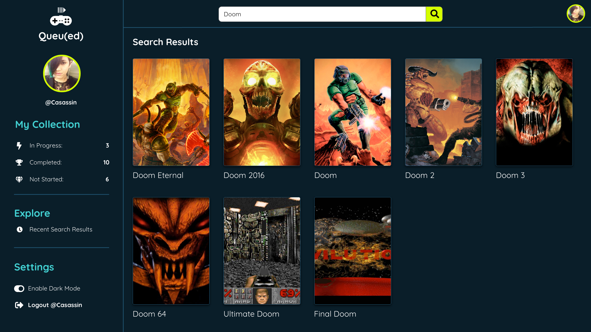
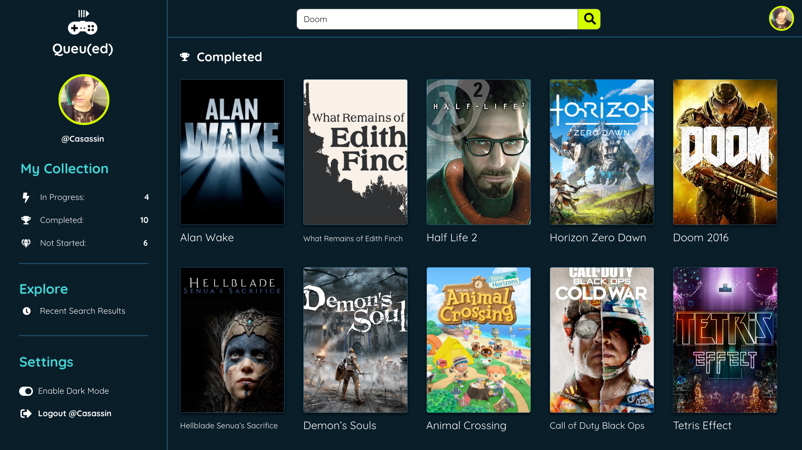
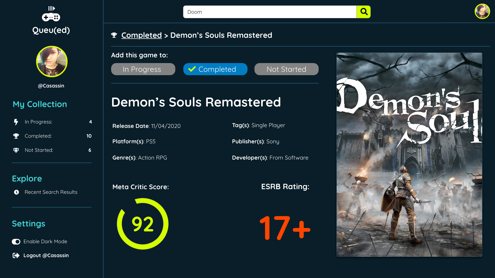

# Table of Contents:
* [Project Description](#Project)
* [Deployed Links](#Links)
* [Usage](#Usage)
* [Credits](#Credits)
* [License](#License)

# Project:
## Title:
# Queued-Video-Game-Tracker-App

## Description:
Queued is a video game application that keep tracks of your video game library. It includes a list of games you have not started, in progress, and beaten.

This is my most ambitious project to date! I worked by myself on this project. I am using the following technologies: Sequelize ORM, Node, Express, HTML/CSS, JS, and IGDB 3rd party api for getting video game data.

## User Story

```
AS A GAMER who frequently plays games
I WANT an application
SO THAT I can easily keep track of all of my games on all platforms
```

## Acceptance Criteria

```
With your team, you’ll conceive and execute a design that solves a real-world problem. In creating your first collaborative full-stack application, you’ll combine a robust back end--with servers, databases, advanced APIs, and user authentication—-to an intuitive front end. You’ll continue to build on the agile development methodologies you’ve used throughout this course, like storing your project code in GitHub, managing your work with a project management tool, and implementing feature and bug fixes using the Git branch workflow and pull requests.
Instead of using the front end you developed for your first project, you should start from scratch. Doing so will help you reinforce your existing front-end abilities and solidify your understanding of the dynamic between the front end and back end. Also, you’ve likely improved your skills since that first project, so with a stronger foundation now you can build a better application, using all of the additional practice you’ve had in the last several weeks.
```

## Config
Please add your user name and password to the config file. Also install npm packages needed to run this program.

## Deployed Link
Heroku Link coming shortly.


#Usage
## Final screenshot




#Credits
Thank you to everyone in the Columbia Engineering Bootcamp.

#License
MIT License

Copyright (c) 2021 Casandra McDonald

Permission is hereby granted, free of charge, to any person obtaining a copy
of this software and associated documentation files (the "Software"), to deal
in the Software without restriction, including without limitation the rights
to use, copy, modify, merge, publish, distribute, sublicense, and/or sell
copies of the Software, and to permit persons to whom the Software is
furnished to do so, subject to the following conditions:

The above copyright notice and this permission notice shall be included in all
copies or substantial portions of the Software.

THE SOFTWARE IS PROVIDED "AS IS", WITHOUT WARRANTY OF ANY KIND, EXPRESS OR
IMPLIED, INCLUDING BUT NOT LIMITED TO THE WARRANTIES OF MERCHANTABILITY,
FITNESS FOR A PARTICULAR PURPOSE AND NONINFRINGEMENT. IN NO EVENT SHALL THE
AUTHORS OR COPYRIGHT HOLDERS BE LIABLE FOR ANY CLAIM, DAMAGES OR OTHER
LIABILITY, WHETHER IN AN ACTION OF CONTRACT, TORT OR OTHERWISE, ARISING FROM,
OUT OF OR IN CONNECTION WITH THE SOFTWARE OR THE USE OR OTHER DEALINGS IN THE
SOFTWARE.
